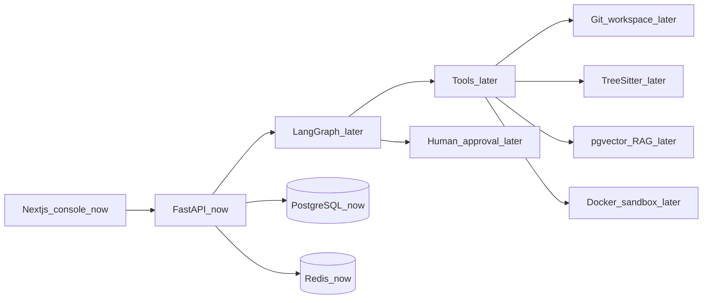

# ARCHITECTURE.md

Planned architecture for ForgeAI. Phase 1 implements the boxes marked **now**. Everything else is specified so later phases have a stable skeleton.

## Context

ForgeAI is an autonomous software engineer: ingest a repository, retrieve relevant code, plan a change, edit files, run tests in isolation, debug failures, review for quality and security, and open a Git change — with a human approval gate.

## Phase 1 and Phase 2 (implemented)

| Component | Role |
| --- | --- |
| `apps/api` | FastAPI process, Pydantic Settings, SQLAlchemy engine/session factory, Redis client, `GET /health` |
| `apps/web` | Next.js operator shell that displays health |
| PostgreSQL 16 | System of record for repositories, runs, jobs, and approvals |
| Redis 7 | Cache/queue substrate (connectivity only) |
| Alembic | Migration runner wired to `Base.metadata` |
| `packages/shared` | Shared version/constants |

Health is a real dependency probe: `SELECT 1` on Postgres and `PING` on Redis. It reports `ok` or `degraded`. It is not an agent.

## Target runtime (later phases)

| Layer | Choice |
| --- | --- |
| Agent orchestration | LangGraph with a Postgres checkpointer |
| Retrieval | Chunks in Postgres + pgvector, hybrid search |
| Parsing | Tree-sitter in `packages/code-intelligence` |
| Jobs / pub-sub | Redis (ARQ or equivalent) |
| Execution | Ephemeral Docker containers in `packages/execution` |
| Git | Isolated workdirs in `packages/git` |
| LLM | Provider adapters in `packages/llm` |
| Observability | OpenTelemetry traces around runs and tool calls |
| Evaluation | Golden tasks in `packages/evaluation` |

## HTTP API (Phase 1)

- `GET /health` — liveness plus Postgres/Redis probes
- OpenAPI at `/docs`

No run, plan, or patch endpoints until those phases.

## Data

Phase 2 adds repositories, runs, jobs, and approvals with UUID keys, foreign keys, lifecycle fields, and timestamps. Code chunks and traces remain deferred.

Alembic uses `DATABASE_URL_SYNC` (`postgresql+psycopg`). The API uses `DATABASE_URL` (`postgresql+asyncpg`).

## Configuration

`Settings` loads `.env` via pydantic-settings. Compose overrides hostnames (`postgres`, `redis`) so the same variable names work locally and in Docker.

## Frontend

The console is a Next.js App Router app. Phase 1 renders health only. Later: run timeline, approval queue, logs.

## Security posture (planned)

- Human approval before applying patches or pushing Git
- Sandbox network/cpu/memory limits
- Reviews must not emit exploit payloads
- No secrets in git
